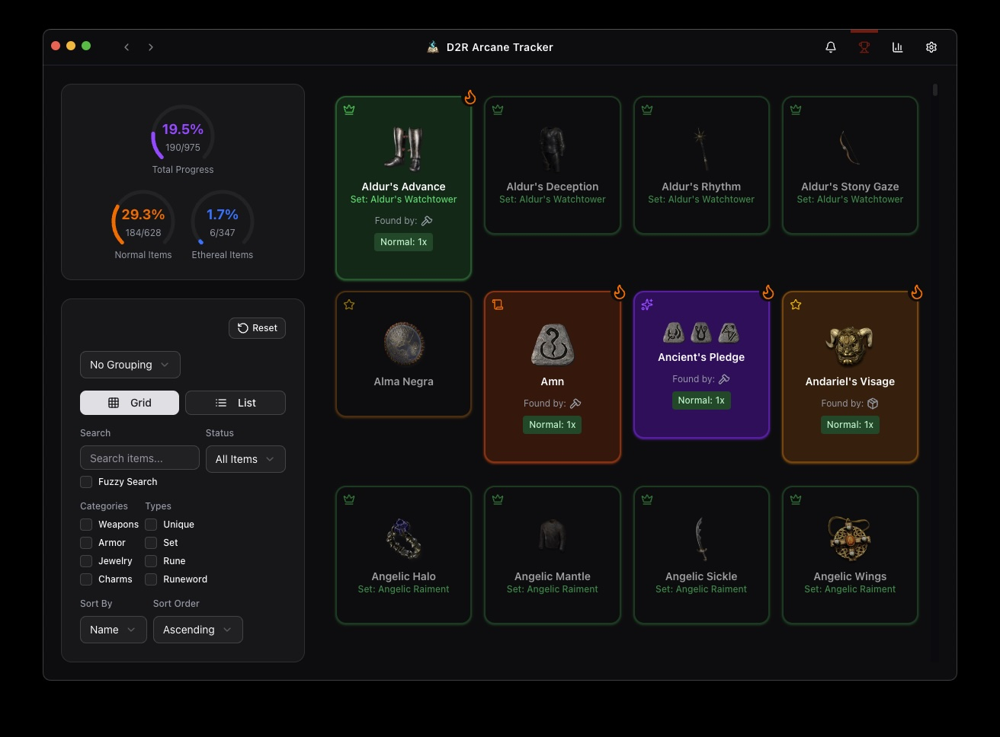
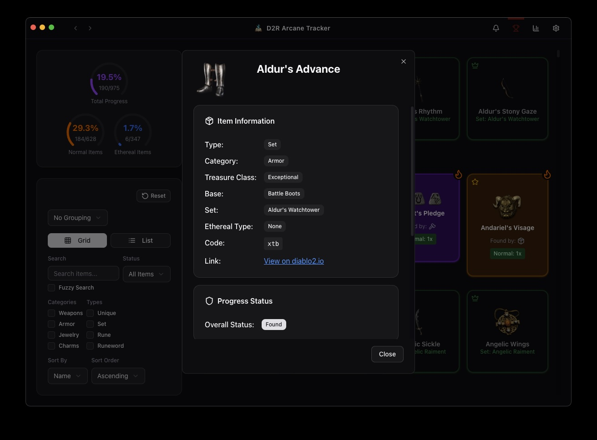
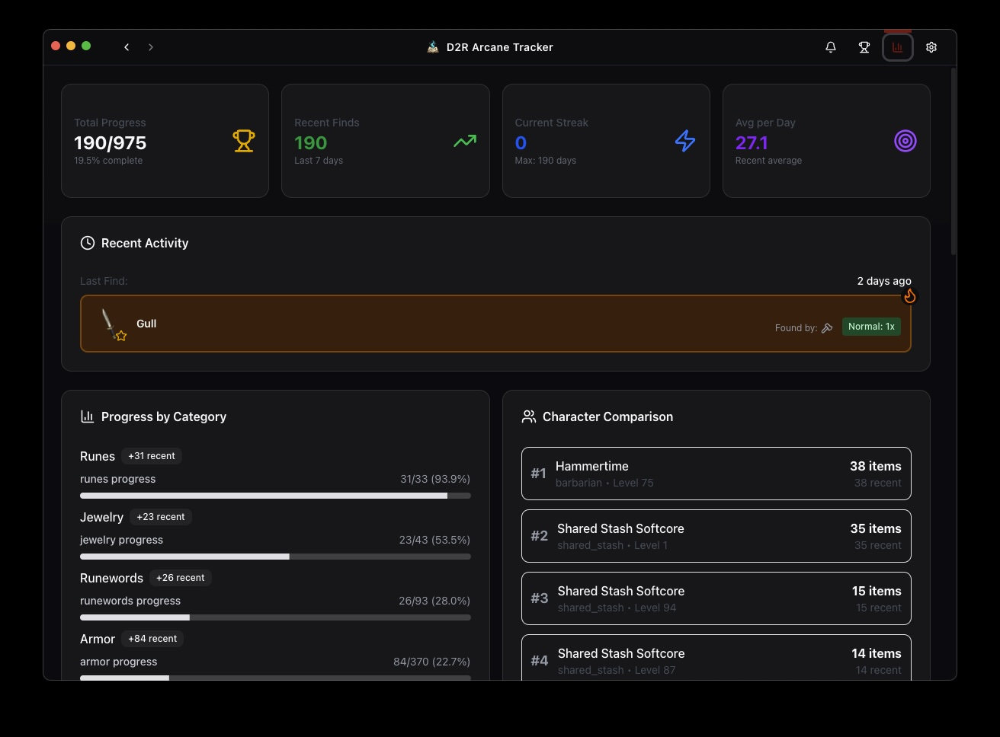

# D2R Arcane Tracker - Holy Grail Tracker for Diablo 2 Resurrected

**The ultimate Holy Grail tracker for Diablo 2 Resurrected (D2R)** - Automatically track your unique items, set items, runes, and complete your Holy Grail challenge

## What is a Holy Grail in D2R?

The Holy Grail challenge in Diablo 2 Resurrected is a popular endgame goal where players aim to find every unique and set item in the game. D2R Arcane Tracker makes this challenge easier by automatically tracking your progress as you play.

📖 **[Read the complete Holy Grail Guide](docs/HOLY_GRAIL_GUIDE.md)** for an in-depth explanation of the challenge, tracking strategies, and how to use D2R Arcane Tracker effectively.

## 📸 Screenshots

### Grail Tracker Dashboard

*Track your Holy Grail progress with an intuitive, searchable interface showing all unique items, sets, and runes*

### Item Details

*View detailed information about each item, including stats and which characters have found it*

### Statistics Overview

*Comprehensive statistics dashboard showing your progress across all item categories*

## ✨ Features

- **🏆 Holy Grail Tracking**: Comprehensive tracking of unique items, sets, and runes
- **📁 Save File Monitoring**: Automatic detection and parsing of D2R save files
- **📊 Progress Analytics**: Visual progress bars, statistics, and completion tracking
- **🎮 Multiple Game Modes**: Support for different game versions and modes
- **🔔 Smart Notifications**: Get notified when new items are found
- **💾 Local Database**: SQLite database for reliable data persistence
- **🎨 Modern UI**: Built with shadcn/ui components and Tailwind CSS

## 🚀 Download & Install

### System Requirements

- **Windows**: Windows 10 or later (64-bit)
- **macOS**: macOS 10.15 or later
- **Linux**: Ubuntu 18.04+ or equivalent
- **Diablo II: Resurrected** installed

### Installation

1. **Download the latest release** from the [Releases page](https://github.com/hyperremix/d2r-arcane-tracker/releases)
2. **Install the application** for your operating system:
   - **Windows**: Run the `D2R Arcane Tracker-Windows-*-Setup.exe` installer
   - **macOS**: Open the `.dmg` file and drag to Applications
   - **Linux**: Extract the `.AppImage` and run directly

3. **Launch the application** and follow the setup wizard

### Windows Installation Notes

- The installer will create a shortcut in your Start Menu
- The application installs to your user directory (no admin rights required)
- Windows may show a "Windows protected your PC" warning - click "More info" then "Run anyway"
- This warning appears because the app is not code-signed (we're working on this!)

## 🎮 Usage

1. **First Launch**: The app will guide you through initial setup
2. **Configure Save File Path**: Set your D2R save file directory in settings
3. **Select Game Mode**: Choose your preferred game version and mode
4. **Start Tracking**: The app will automatically monitor your save files
5. **View Progress**: Check your Holy Grail progress in the main dashboard

### Key Features Explained

- **Automatic Detection**: The app monitors your save files and automatically updates when new items are found
- **Progress Tracking**: Visual progress bars show completion percentages for different item categories
- **Advanced Search**: Filter and search through your tracked items
- **Statistics Dashboard**: View detailed statistics about your progress

## 🔧 Troubleshooting

### Common Issues

**App won't start:**

- Ensure you have the latest version installed
- Check that your system meets the minimum requirements
- Try running as administrator (Windows) or with sudo (Linux)
- **Windows**: If you see "Windows protected your PC", click "More info" then "Run anyway"

**Save files not detected:**

- Verify the save file path in Settings is correct
- Ensure D2R is installed and you have created at least one character
- Check that the save files are not corrupted
- **Windows**: Default save path is usually `%USERPROFILE%\Saved Games\Diablo II Resurrected`

**Items not updating:**

- Make sure the app has permission to read your save files
- Try restarting the application
- Check if D2R is running (some features require D2R to be closed)

**Windows-specific issues:**

- **Antivirus blocking**: Add the application to your antivirus exceptions
- **Firewall prompts**: Allow the application through Windows Firewall
- **Missing Visual C++ Redistributables**: Download and install from Microsoft
- **Permission denied**: Run as administrator if save file access is restricted

### Getting Help

If you're still having issues:

- Check the [GitHub Issues](https://github.com/hyperremix/d2r-arcane-tracker/issues) for known problems
- Join the [GitHub Discussions](https://github.com/hyperremix/d2r-arcane-tracker/discussions) for community support
- Create a new issue with detailed information about your problem

## 📚 Documentation

### Comprehensive Guides

- **[Holy Grail Guide](docs/HOLY_GRAIL_GUIDE.md)** - Complete guide to the Holy Grail challenge, tracking strategies, and using D2R Arcane Tracker
- **[Tracker Comparison](docs/COMPARISON.md)** - Detailed comparison with other Holy Grail tracking solutions to help you choose the right tool

## 🤝 Contributing

We welcome contributions! Please see our [Contributing Guidelines](CONTRIBUTING.md) for detailed information on how to get started.

## 📄 License

This project is licensed under the MIT License - see the [LICENSE](LICENSE) file for details.

For information about third-party licenses, trademarks, disclaimers, and usage guidelines, see [THIRD_PARTY_LICENSES.md](docs/THIRD_PARTY_LICENSES.md).

## 🆘 Support

- **Issues**: [GitHub Issues](https://github.com/hyperremix/d2r-arcane-tracker/issues)
- **Discussions**: [GitHub Discussions](https://github.com/hyperremix/d2r-arcane-tracker/discussions)

## 📊 Project Status

## Keywords

Diablo 2 Resurrected tracker, D2R grail tracker, Holy Grail D2R, D2R item tracker, Diablo 2 Holy Grail tracker, D2R unique tracker, D2R set tracker, Diablo 2 Resurrected item finder

---

Made with ❤️ for the Diablo II: Resurrected community

Happy farming! 🏆
