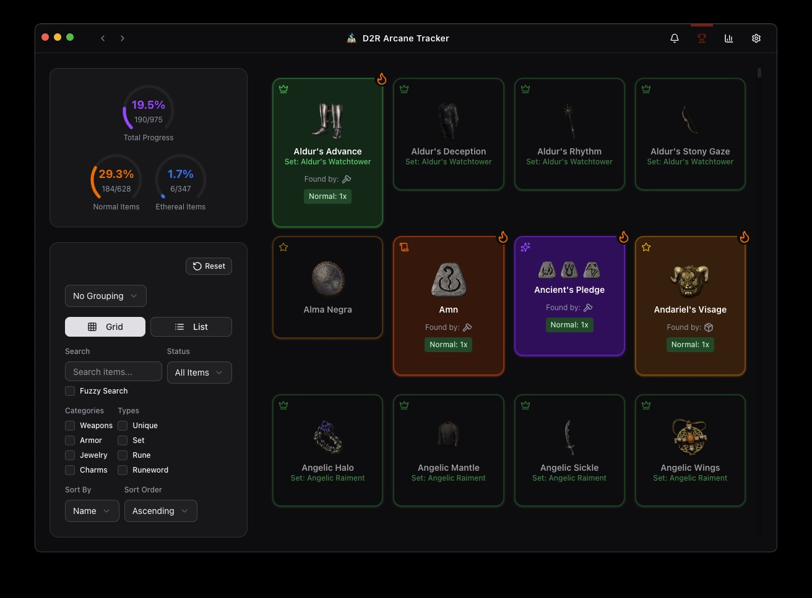
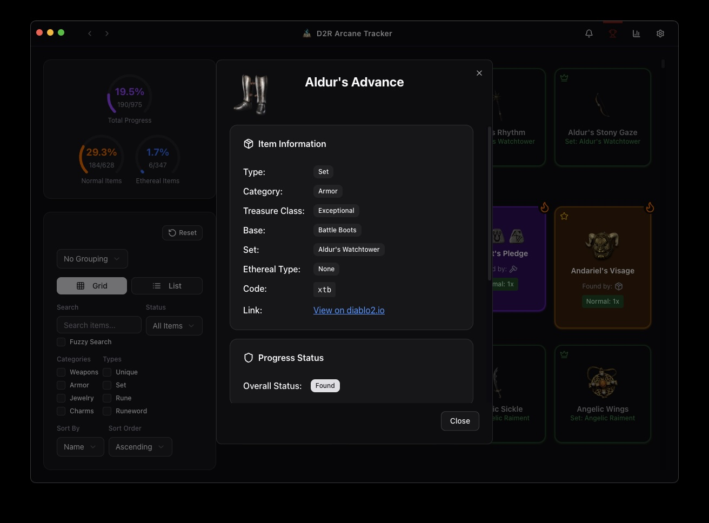
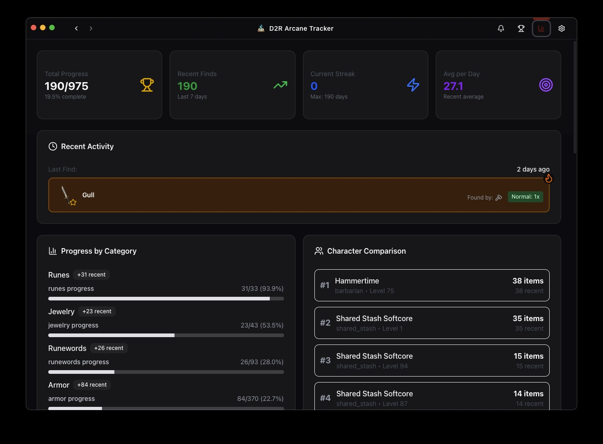

# D2R Arcane Tracker

A desktop Holy Grail tracker for Diablo II: Resurrected. It reads your save files and records every unique, set item, rune and runeword you find, without you having to enter anything.

[Website](https://hyperremix.github.io/d2r-arcane-tracker/) · [Download](https://github.com/hyperremix/d2r-arcane-tracker/releases/latest)

| Item details | Statistics |
| --- | --- |
|  |  |

## Features

- **Automatic detection**: watches your save folder and logs new grail items from characters and the shared stash.
- **Configurable grail**: track normal and ethereal items, runes and runewords, for softcore, hardcore or both.
- **Run Tracker**: farming sessions with per-run timing and loot, started automatically or with keyboard shortcuts. CSV, JSON and text export.
- **Runeword Calculator**: shows which runewords you can make with the runes you have.
- **Terror Zone Configuration**: choose which terror zones the game rotates through.
- **Overlay widget, statistics and notifications**.
- **Local only**: data lives in a SQLite database on your machine.

## Install

Requires Windows 10 or later (64-bit) and Diablo II: Resurrected.

1. Download `D2R-Arcane-Tracker-Windows-<version>-Setup.exe` from the [latest release](https://github.com/hyperremix/d2r-arcane-tracker/releases/latest).
2. Run the installer. The app isn't code-signed, so Windows may show "Windows protected your PC". Click **More info → Run anyway**.
3. Start the app and follow the setup wizard. Your save folder is usually `%USERPROFILE%\Saved Games\Diablo II Resurrected`.

The app checks for updates on startup and installs them when you confirm.

## Documentation

| Guide | Covers |
| --- | --- |
| [Holy Grail Guide](docs/HOLY_GRAIL_GUIDE.md) | The challenge, setup, tracking options, how detection works, and the other app features |
| [Inventory Browser Guide](docs/INVENTORY_BROWSER_GUIDE.md) | Browsing, moving and vaulting items in your save files, and the safety rules |
| [Run Tracker Guide](docs/RUN_TRACKER.md) | Sessions, runs, auto mode, shortcuts and exports |
| [Terror Zone Configuration](docs/TERROR_ZONE_CONFIGURATION.md) | Changing the terror zone rotation |
| [Extracting Game Files](docs/EXTRACTING_GAME_FILES.md) | CASC extraction, needed for item icons and terror zones |
| [Tracker Comparison](docs/COMPARISON.md) | How this app compares to other grail trackers |

## Troubleshooting

- **No characters show up**: check the save folder in **Settings → Save File Monitoring** and make sure you have created at least one character.
- **Items don't update**: D2R only writes save files when you leave a game, so new items show up after you exit to the menu.
- **Antivirus blocks the app**: add an exception for the install folder. Unsigned Electron apps sometimes cause false positives.
- **Run detection stopped after a game patch**: see [Run Tracker troubleshooting](docs/RUN_TRACKER.md#troubleshooting).

If that doesn't help, search the [issues](https://github.com/hyperremix/d2r-arcane-tracker/issues) or open a new one, or ask in [Discussions](https://github.com/hyperremix/d2r-arcane-tracker/discussions).

## Contributing

See [CONTRIBUTING.md](CONTRIBUTING.md). To report a vulnerability, see [SECURITY.md](SECURITY.md).

## License

[MIT](LICENSE). Diablo II: Resurrected is a trademark of Blizzard Entertainment, and this project isn't affiliated with Blizzard. See [Third-Party Licenses and Legal](docs/THIRD_PARTY_LICENSES.md).
